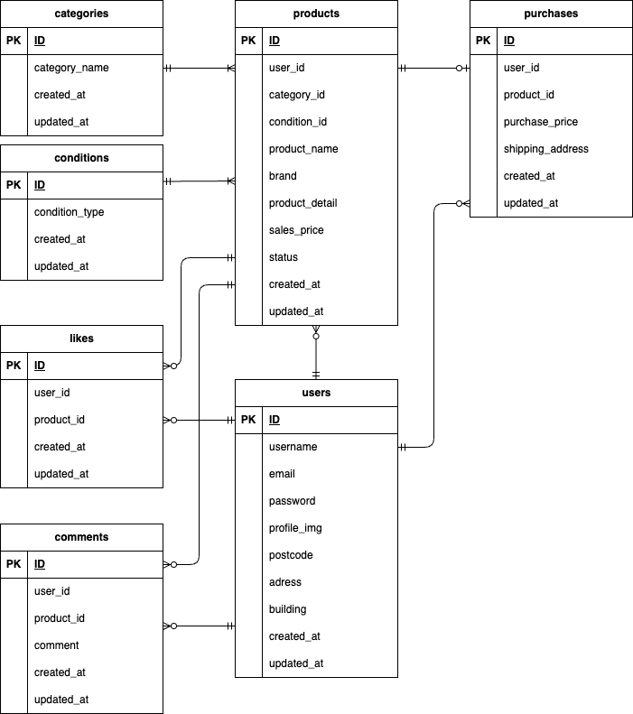

# coachtechフリマ(フリーマーケットアプリ)

## coachtechフリマの概要
本アプリは、ある企業が開発した独自のフリマアプリです。

**制作の背景と目的**
- 10代〜30代の社会人をターゲットにした、アイテムの出品と購入を行うフリマアプリを開発しました。
- 調査の結果、競合他社のフリマアプリは、「機能や画面が複雑で使いづらい」といった声がありましたので、本アプリでは、「使いやすさ」を重視しています。

**制作の目標**
- 本アプリをリリース後は、初年度でのユーザー数を1000人達成することを目指しています。

## 開発環境
**Dockerビルド**

**Laravel環境構築**

## 使用技術（実行環境）

## ER図
